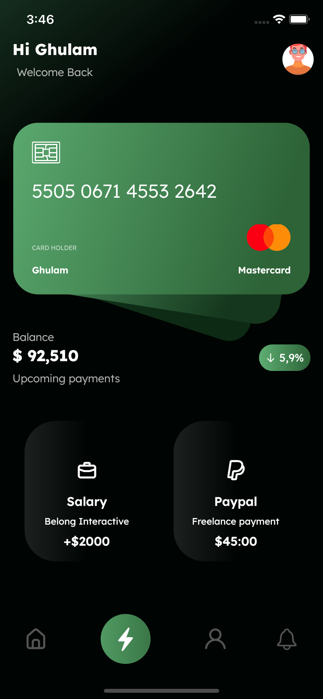

# Ui Clone em flutter de gerenciador de cartões de crédito

link para design de exemplo: [Dribbble - Finance Mobile App Design](https://dribbble.com/shots/15167068-Finance-Mobile-App-Design)

### Descrição

Este projeto é um ui clone de um design disponibilizado pelo no [Dribbble](https://dribbble.com). Esse clone Não está completamente fidedigno pela dificuldade em identificar as fonts, e anexos usados no projeto. Esse projeto foi todo desenvolvido completamente em [flutter](https://flutter.dev).

  

  

  

  
